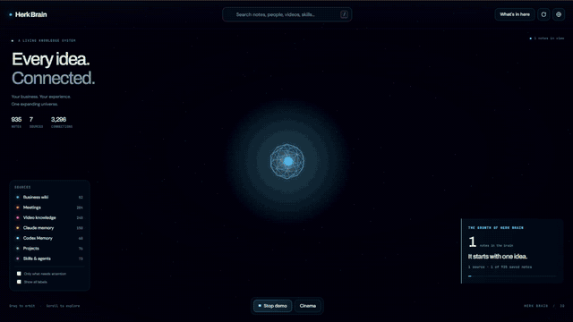

# AI-Verse OS

**AI-Verse OS** is a domain-neutral AI operating system that gives capable AI runtimes persistent context, isolated workspaces, reusable capabilities, connected systems, durable knowledge, and safe automation structure.

It is intentionally not designed around one profession. A doctor, developer, filmmaker, researcher, consultant, student, operator, founder, team, or someone with a completely different type of work should be able to start from the same core. The OS learns the domain from evidence and evolves structure inside the relevant workspace instead of hardcoding industries into the foundation.

**AI-Verse Community:** https://www.skool.com/bogdans-ai-verse-4398

## Install

AI-Verse OS now ships with a small cross-platform CLI.

### First member beta: frozen five-component release

The first-member beta is frozen to exact immutable revisions of OS, Brain, Memory, Skills, and Data.

Use the reproducible install guide:

- [Five-Component First Member Beta Install](docs/FIVE-COMPONENT-BETA-INSTALL.md)

Do not substitute moving `main` branches when reproducing the tested beta.

### Development channel from moving `main`

For OS-only development against the newest `main`:

```bash
npx --yes github:aiverse-filmmakers/AI-Verse-OS install
```

That downloads the latest development OS into `./AI-Verse-OS`, validates the core architecture, and confirms the Claude and Codex onboarding skills are present.

To install the moving-development `ai-verse-os` command:

```bash
npm install -g github:aiverse-filmmakers/AI-Verse-OS
```

Then the normal commands are:

```bash
ai-verse-os install
ai-verse-os doctor
ai-verse-os onboard
ai-verse-os update
ai-verse-os version
```

Once the npm package is published, the first-run experience can become simply:

```bash
npx ai-verse-os install
```

The OS CLI requires Node.js 18+ and Git. Node.js 22+ is the baseline for the complete five-component beta.

## Core design principle

> **One OS. One source of truth. Many isolated workspaces. Reusable capabilities. Connected systems. Automated cadence. Apps on top.**

The conceptual capability stack is:

```text
Context
  -> Data / Knowledge
  -> Connections
  -> Workspaces
  -> Skills
  -> Agents
  -> Apps / Automations
```

Those are capability layers, not seven duplicated folder trees.

## Architecture v2: Unified Workspace Architecture

AI-Verse OS v2 organizes the filesystem around four things that matter more than profession names:

1. **Ownership:** what belongs to the OS versus the user.
2. **Scope:** operator-wide, shared, or isolated workspace state.
3. **Lifecycle:** inbox, context, memory, knowledge, decisions, capabilities, archive.
4. **Authority:** which source wins when information conflicts.

The machine-readable map is `AI-VERSE.yaml`. The full design is in `system/architecture/`.

## Universal workspace model

A workspace is the universal isolation primitive. It can represent any meaningful scope of work:

- a project
- a role
- a client or case
- a research area
- a practice
- a product
- a team
- a course or study
- a personal area
- any custom type the operator needs

AI-Verse OS does not force those categories. `WORKSPACE.yaml` supports free-form `type` and `domains` so the system can adapt to work that was never anticipated by the template.

Workspace-specific knowledge stays local first. Only proven reusable knowledge and capabilities should be promoted into shared layers.

## System versus user ownership

### System-owned

Safe for AI-Verse OS updates to evolve deliberately:

```text
AGENTS.md
CLAUDE.md
AI-VERSE.yaml
system/
skills/registry.yaml
.claude/skills/
.agents/skills/
scripts/
```

### User-owned

Never overwrite casually during updates:

```text
operator/
knowledge/
workspaces/
connections/registry.yaml
agents/registry.yaml
automations/
apps/
```

### Derived / disposable

```text
runtime/
```

If deleting `runtime/` destroys irreplaceable knowledge, something is in the wrong layer.

## Repository layout

```text
AI-Verse-OS/
├── README.md
├── AGENTS.md                     # canonical runtime contract
├── CLAUDE.md                     # Claude adapter
├── AI-VERSE.yaml                 # machine-readable architecture
├── EXPANSIONS.md
├── SKILL-AUTHORING.md
├── ai-verse-os-intake.md
│
├── system/
│   ├── architecture/
│   ├── schemas/
│   ├── templates/
│   └── health/
│
├── operator/                     # user-owned operator state
│   ├── profile/
│   ├── context/
│   ├── memory/
│   ├── inbox/
│   └── decisions/
│
├── knowledge/                    # reusable cross-workspace knowledge
├── workspaces/                   # isolated scopes of work
│   └── _template/
├── connections/                  # live source registry and integration notes
├── skills/                       # runtime-neutral capability registry
├── agents/                       # orchestration registry
├── automations/                  # jobs, triggers, policies
├── apps/                         # persistent interfaces
├── runtime/                      # disposable indexes/cache/logs/reports
├── archives/
│
├── references/                   # v1/system framework compatibility
│   ├── 3ms-framework.md
│   └── 4cs-framework.md
├── .claude/skills/               # current Claude skill packages
├── .agents/skills/               # Codex-compatible copies
└── scripts/
```

User-owned state is gitignored by default in this public template. The tracked example files and `_template` workspace show the contract without encouraging people to publish personal or sensitive data.

## Knowledge lifecycle

AI-Verse OS distinguishes information by what it means:

```text
incoming material
      ↓
    inbox
      ↓
   classify
      ↓
 ┌───────────────┬────────────┬────────────┬────────────┐
 context       memory       knowledge     decision
 now           history      reusable      settled choice
                                │
                                ↓
                         skill / automation
                                │
                                ↓
                              archive
```

Raw material never becomes canonical truth simply because it arrived.

## Domain adaptation

The core does not pre-create profession folders. Instead, when real work reveals a domain, AI-Verse OS learns:

- terminology and entities
- authoritative sources
- quality standards
- constraints and approvals
- common workflows
- useful outputs
- domain-specific failure modes

That structure begins inside a workspace. Reusable knowledge can later be promoted to root `knowledge/`, and portable workflows can become shared skills.

See `system/architecture/domain-adaptation.md`.

## Source of truth

AI-Verse OS uses explicit authority rules instead of hoping the newest-looking file is correct.

At a high level:

- `AGENTS.md` -> runtime behavior
- `AI-VERSE.yaml` -> architecture and routing
- operator/workspace current context -> current state
- decisions -> why settled choices changed
- curated knowledge -> durable reusable truth
- archives -> history only
- vector/search indexes -> derived views only

See `system/architecture/source-of-truth.md`.

## Four Cs

| Layer | Purpose |
|---|---|
| **Context** | Knows the relevant operator and workspace state |
| **Connections** | Reaches required systems and sources |
| **Capabilities** | Performs repeatable work through skills, agents, scripts, and workflows |
| **Cadence** | Runs mature work from schedules or events with appropriate controls |

Full breakdown: `references/4cs-framework.md`.

## Three Ms

| M | Purpose |
|---|---|
| **Mindset** | Look for where AI can create leverage |
| **Method** | Find the constraint, remove unnecessary work, map the process, choose autonomy, define the outcome |
| **Machine** | Build the smallest reliable blocks, validate them, supervise rollout, keep controls |

Full breakdown: `references/3ms-framework.md`.

## Included foundation capabilities

| Capability | Purpose |
|---|---|
| `/onboard` | Build universal operator context and initial workspace routes from a seven-question intake |
| `/workspace` | Create or evolve an isolated workspace without assuming a profession |
| `/grill-me` | Capture deeper knowledge while separating confirmed facts from exploration |
| `/link` | Make a source findable without duplicating it |
| `/audit` | Verify architecture, Four Cs, routing, freshness, isolation, and evidence |
| `/level-up` | Use the Three Ms to ship one high-value improvement |
| `/3d-brain` | Build the interactive 3D knowledge explorer from selected sources |

## 3D Brain

The included `/3d-brain` capability remains an optional application layer. It visualizes selected knowledge sources without becoming the source of truth itself.

[](https://github.com/aiverse-filmmakers/AI-Verse-OS/raw/refs/heads/main/docs/media/3d-brain-demo.mp4)

## Quick start

1. For the frozen first-member beta, follow `docs/FIVE-COMPONENT-BETA-INSTALL.md`. For OS-only development, use the moving-`main` install command above.
2. Enter the new `AI-Verse-OS` folder.
3. Open that folder in your supported AI coding/runtime environment.
4. In Claude Code run `/onboard`; in Codex run or select `$onboard`. If you installed the CLI globally, you can alternatively run `ai-verse-os onboard`.
5. Answer the seven universal intake questions.
6. Let AI-Verse OS create operator state and the minimum useful workspace structure.
7. Use `/workspace` when a substantial new scope of work deserves isolation.
8. Use `/link` for important sources and `/grill-me` for knowledge still in your head.
9. Run `/audit` after setup or major changes.
10. Run `/level-up` when a repeated constraint should become a better process, skill, script, connection, or automation.

## Privacy by default

This repository is a public template. User-owned state is ignored by Git by default. Never store secrets in the repository. People who deliberately keep AI-Verse OS in a private repository can choose a different version-control policy for their own state.

## Legacy installations

Architecture v1 used root `context/`, `references/`, `decisions/`, and `connections.md`. Those paths remain supported for deliberate migration and system-framework compatibility. Existing user data must be preserved. New canonical user state should use the v2 paths in `AI-VERSE.yaml`.

## License

See `LICENSE` and `THIRD-PARTY-NOTICES.md`.
